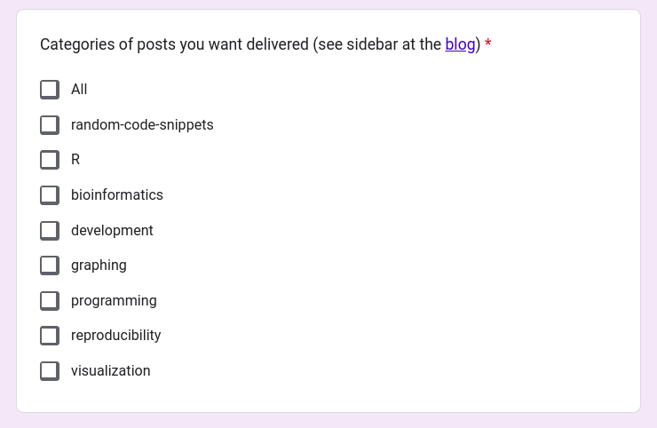
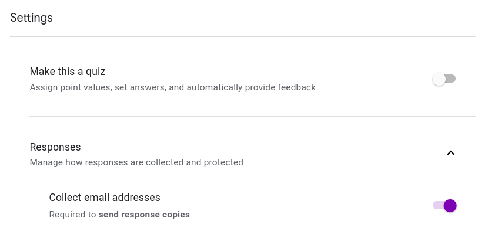
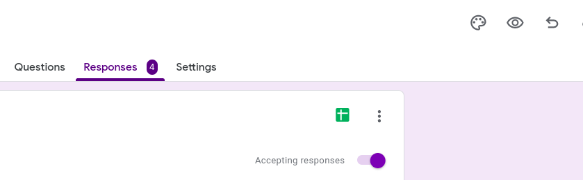

<!-- README.md is generated from README.Rmd. Please edit that file -->

```{r, include = FALSE}
knitr::opts_chunk$set(
  collapse = TRUE,
  comment = "#>",
  fig.path = "man/figures/README-",
  out.width = "100%"
)
```

# blog2newsletter

<!-- badges: start -->
<!-- badges: end -->

The goal of blog2newsletter is to provide a **relatively** simple way to send your R based blog posts as emails to subscribers.

## Installation

You can install the development version of blog2newsletter from [GitHub](https://github.com/) with:

``` r
# install.packages("remotes")
remotes::install_github("rmflight/blog2newsletter")
```

## 2 Second Overview

* The blog in question has an RSS feed where each entry is essentially the full post.
* Have subscribers and categories they want to know about in a Google Sheet, a copy of which is stored locally as well.
* `{tidyRSS}` parses the RSS to get an emailable version of the post, we find subscribers to email based on matching categories, and draft an email.
* `{gmailr}` either shows us the draft, or sends the newsletter email, and records that we sent it in the cache so we don't accidentally send multiples of the same post.

## Prerequisites

The current version is based on a particular workflow:

* GMail to send the messages;
* Google Forms and Google Sheets to store the subscriber information;
* Blog RSS feed to generate the content that goes in each newsletter.

This means you need a Google account, and a project, with the Gmail and Google Sheets API authorized.
We may eventually change what pieces are needed, but right now, this is what it expects.

The `gmailr` [quick start](https://gmailr.r-lib.org/articles/gmailr.html) has a good example of how to set up a project with the right permissions.

### Gmail Oauth Scopes

One very important thing to note, is when you do the initial oauth setup, whatever `scopes` you use then, when you set it up again in the `{blog2newsletter}` workflow, make sure the `scopes` is identical, or you will have to do the whole browser oauth flow **again** (ask me how many times it took before I realized I had a different scope causing this).

For this project, really all you need are the `compose` and `send` scopes, so that you can see the draft in Gmail if you want, and send on your behalf, as shown here:

```r
gm_auth(scopes = c("compose", "send"), ...)
```

### Google Sheets Oauth Scopes

Similarly, Google Sheets only needs to be able to read the response sheet you are using to record the form responses.

```r
gs4_auth(scopes = "https://www.googleapis.com/auth/spreadsheets.readonly", ...)
```

### A Note on Storing the Secrets JSON and Oauth

I definitely recommend having a specific Google project for this so that API secrets don't need to be shared across projects.
In addition, the directory / R project should be on it's own, not part of your blog directory if you use a static site generator, and committing nothing, except maybe the `_blog2newsletter.R` script if you really want to.
This helps to avoid accidentally committing the secrets and tokens you are generating.
Whether part of a blog directory project or not, you can help avoid accidentally commiting them to git using `{usethis}` to add the `secrets` directory to the `.gitignore` file.

```{r}
#| label: add_secrets_gitignore
#| eval: false
usethis::use_git_ignore("secrets")
```

## Subscription Categories

Another aspect that is used heavily are blog post categories.
In many cases, blogs use categories so readers can find things that are more interesting to them.
For example, I would guess that more people probably read my posts that focus on `R` (I actually am guessing because I don't actually track my traffic) than some other categories.
Therefore, you can give your potential subscribers categories to choose from.

Here are the categories I put on my own subscription form:

```{r}
#| label: view_form
#| echo: false

```

These categories are based on looking at my blog sidebar, and looking at the categories with the most posts.

**If you don't have categories, you can give the option for ALL, and subscribers will get every post**.

## Getting Setup

### Create a Google Form to Store Subscribers

Assuming you have a Google account (which lets face it, is basically assumed for this entire workflow), create a form at https://docs.google.com/forms.

This form should **collect emails** (seriously, you can't get an email newsletter without an email address):

Settings -> Responses -> Collect email addresses -> On

```{r}
#| label: collect_emails
#| echo: false

```

If using **categories**, add your categories as **checkboxes** so subscribers can choose multiple subjects of posts.
If **not using** categories, I would at least add the option for "All".
Mainly because this first version of `{blog2newsletter}` checks for that one, and the absence of any other categories means that no one will get your newsletter.

Make sure to put the link to the form somewhere prominent on your blog!

### Setup an R / RStudio Project

We are going to pretend we've made a project called `blog_subscriptions`.

Here is the overall file structure that we'll end up with for this project.
Keep in mind that the file names for the secrets and oauth will be different, this just shows where they are in my setup.

```
├── _blog2newsletter
│   ├── emails
│   └── subscribers
├── _blog2newsletter.R
├── secrets
│   ├── google-project-secrets.json
│   └── gargle_cache
│       ├── gmailr_oauth
│       └── goooglesheets4_oauth
```

### Google Secrets and Oauth

Download the secrets JSON file from your Google project, and store it in `secrets` (or your chosen location).

Do the oauth setup for `{gmailr}` and `{googlesheets4}`.
You can do that using the code below, and it should give you a browser window to verify yourself.
Once the oauth tokens are stored, you won't have to do the browser again until the token expires, as long as you don't change the `scopes` parameter.

This code, by the way, **should always** be at the top of either `_blog2newsletter.R`, or any other script you use to generate the newsletter.

```{r}
#| label: oauth_setup
#| eval: false
options(
  gargle_oauth_cache = "secrets/gargle_cache/",
  gargle_oauth_email = "your_email@gmail.com"
)

library(gmailr)
gm_auth_configure(path  = "secrets/secrets_file.json")
gm_auth(scopes = c("compose", "send"), email = "your_email@gmail.com")

library(googlesheets4)
gs4_auth_configure(path = "secrets/secrets_file.json")
gs4_auth(
  scopes = "https://www.googleapis.com/auth/spreadsheets.readonly",
  email = "your_email@gmail.com")
```

### Setup the blog2newsletter Cache Folder

There are two files that `{blog2newsletter}` uses to keep track of things, `subscribers` and `emails`.

* `subscribers`: stores a local copy of the form submissions from the Google Sheet so you aren't always fetching a new copy.
Defaults to refetching after 168 hours (a week).
* `emails`: stores what emails you've actually sent, so you don't accidentally send one again, unless you really want to for some reason.

The default location for these is in a folder called `_blog2newsletter`.
Every function that uses the cache, also has a `cache` argument.

```{r}
#| label: setup_cache
#| eval: false
library(blog2newsletter)
b2n_create_cache()
```

If you don't do this, you will get a message when you go to get subscriber data or draft the email.

### Get Subscriber Sheet ID

Now we grab the subscriber sheet ID from Google, and we will copy it into our newsletter script.

```{r}
#| label: get_sheet_id
#| eval: false
sheet_id = googlesheets4::as_sheet_id("urltosheet")
unclass(sheet_id)
# copy this into your script to use for access, or use the URL if you want
```

You can see the responses as a Google Sheet by clicking the little **sheet** icon on your form responses.

```{r}
#| label: show_sheets
#| echo: false

```

And generate an initial cache of your subscriber info.

```{r}
#| label: get_subscribers
#| eval: false
subscribers_id = "your-sheet-id-from-above"
subscriber_data = b2n_fetch_subscribers(subscribers_id)
```

### Blog RSS

If you don't already have an RSS feed for your blog, you **need** to set one up if you want to use `{blog2newsletter}` (see [here](https://quarto.org/docs/websites/website-blog.html#:~:text=RSS%20Feed,-Blogs%20typically%20include%20an%20RSS) for `{quarto}` blogs, as well as [distill](https://rstudio.github.io/distill/blog.html#rss-feed) and [blogdown](https://coolbutuseless.bitbucket.io/2018/02/07/blogdown-rss-feed-of-full-articles/)).
Thus far, I've only heavily tested `{blog2newsletter}` using a local RSS feed from a `{quarto}` based blog.
These RSS feeds basically put the **entirety** of each post in each entry of the RSS.
**You should confirm this is the case for your own blog! If it is not, you should change your blog configuration so that the full contents are available at the RSS, and not just a preview or snippet.**
We query the RSS feed, grab the blog post asked for (typically the latest), and then push it into an email to be sent from GMail
However, it works for any RSS feed that `{tidyrss}` can parse, including any hosted on the web, in case you want to use this for a different blogging platform.

We need to tell our script where the RSS feed lives.
For `{quarto}` blogs with default outputs, we just need the blog directory.
Alternatively, provide the full path to the `index.xml` file, or the URL of the hosted version are.

```{r}
#| label: rss_feed
#| eval: false
# default
blog_dir = "~/path_to/blog_source"
# another local blog source
blog_dir = "~/path_to/blog_source/rendered/index.xml"
# web based
blog_dir = "https://myblog.com/rss.xml"
```

### Test Composing and Sending

Finally, we can fetch the blog post and draft the email newsletter we want to send.
Note that we add a subject in front of the post title to add to your email, normally as a way to tell those getting the email that it is a newlsetter email.
It will be **prepended** to the title of the post being sent out.

```{r}
#| label: draft_email
#| eval: false
draft_email = blog_dir |>
  b2n_post_to_email() |>
  b2n_add_subscribers(subscriber_data) |>
  b2n_from("your_email@gmail.com") |>
  b2n_add_subject("cool newsletter!")
```

If you want to preview it (and you authorized `gmailr` with the correct scopes), then you can use `b2n_draft_email` to push it to your GMail account and preview the email that is in `draft_email`.
This is a thin wrapper around `gmailr::gm_create_draft`, as `blog2newsletter` stores the draft email as a list, with the email, and the post data so it can be checked against previously sent newsletter emails.

```{r}
#| label: view_draft
#| eval: false
b2n_draft_email(draft_email)
```


## Sending Posts as Emails / Newsletters

The easiest way to semi-automate sending your posts is to put all the necessary code in a `.R` file with the name `_blog2newsletter.R`.
This file is created by default when you run `b2n_create_cache()`.

This file includes the oauth code we used above, and goes through most of the steps from above.

Here is an example to start from.

```r
library(gmailr)
library(googlesheets4)
library(blog2newsletter)
secrets_path = "secrets/client_secret_file_googleusercontent.com.json"
oauth_cache = "secrets/gargle_cache/"

# don't forget to use your actual email
my_gmail = "my-gmail@gmail.com"

# switch from directory, full path to index.xml, or url as needed
blog_dir = "blog-directory"

# newsletter subject
extra_subject = "my newsletter"

options(
  gargle_oauth_cache = oauth_cache,
  gargle_oauth_email = secrets_path
)

gm_auth_configure(path  = secrets_path)
gm_auth(scopes = c("compose", "send"), 
        email = my_gmail)

gs4_auth_configure(path = secrets_path)
gs4_auth(
  scopes = "https://www.googleapis.com/auth/spreadsheets.readonly",
  email = my_gmail)

subscribers_id = "your-sheet-id"

subscriber_data = b2n_fetch_subscribers(subscribers_id)

blog_dir |>
  b2n_post_to_email() |>
  b2n_add_subscribers(subscriber_data) |>
  b2n_from(my_gmail) |>
  b2n_add_subject(extra_subject) |>
  b2n_send_newsletter()
```

Then, when you have new post that you want to send, in the subscription project, you only have to do:

```{r}
#| label: run_script
#| eval: false
blog2newsletter::b2n_run()
```

This `source`'s the file `_blog2newsletter.R` by default, and your newsletter is sent or drafted!
